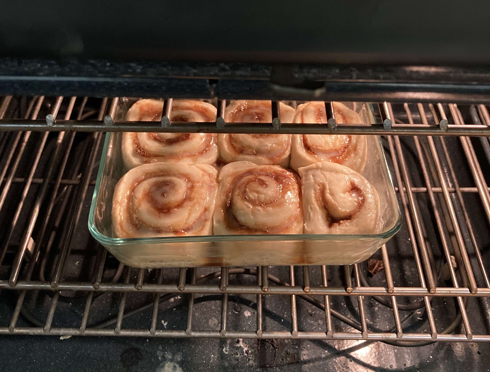

:::::::::::::::::::::::::::::::::::::: questions 

- How do you prepare the sourdough cinnamon rolls?

::::::::::::::::::::::::::::::::::::::::::::::::

::::::::::::::::::::::::::::::::::::: objectives

- Be able to produce a batch of delicious cinnamon rolls
- Understand how to adjust proofing time

::::::::::::::::::::::::::::::::::::::::::::::::

## The Night Before

**Mix the dough:** 

- Use a box grater to shred the cold butter into a large mixing bowl.
- Add the flour to the bowl and use a fork, bench scraper, or pastry cutter (if you have one) to cut the butter into the flour.
- Add the sourdough starter discard, buttermilk, honey and salt.
- Use a spatula or wooden spoon to mix until the ingredients are well incorporated.
- Cover the bowl and let it rest for 10-12 hours, depending on the temperature of your kitchen (more time for cooler kitchens, less time for warmer ones).

## The Next Morning

**Make cinnamon sugar filling and glaze:**

- Mix the brown sugar and cinnamon in a small bowl.
- In a separate bowl, mix the glaze ingredients.
- Preheat oven to 375°F (190°C) and batter a 12" cast iron skillet or deep baking container (glass or enamel will work just 
fine).

**Add leavening agents to dough:**

*If using active sourdough starter, skip this step.*

- Use a fork to mix the baking powder and baking soda in a small bowl until they are evenly mixed with no clumps.
- Sprinkle the mixture evenly on top of the dough and use your hands to mix it in, distributing it evenly throughout the dough.

**Roll out the dough:**

- Flour your work surface generously and tip the dough out of the bowl onto it.
- Sprinkle flour across the top of the dough.
- Use a rolling pin to roll the dough into a roughly 12" x 24" (30cm x 61cm) rectangle, which should be about 1/4" (0.5cm) thick.

**Cut out rolls:**

- Use a pastry brush to coat the top of the dough with melted butter. If you don't have a pastry brush, you can drizzle it and use a finger to spread it somewhat evenly.
- Sprinkle the cinnamon-sugar mixture evenly over the surface of the rolls so that it sticks to the melted butter, leaving a half inch (1cm) bare along the edges.
- Starting on one of the long sides of the rectangle, roll the dough into a log shape, so the log is about 24" (61cm) long
- Use the bench scraper or a knife to cut the log into 12 pieces, approximately 2 inches (5cm) long.
- Arrange the pieces in the baking vessel so the "swirls" are upright, leaving space in between each piece so they can expand while baking.

**Bake:**

- Bake the cinnamon rolls for 35-40 minutes or until the tops show a nice golden-brown color.
- Remove from the oven and drizzle glaze over the rolls while they are still hot.

{alt='A bunch of cinnamon rolls in a baking tray in an oven.'}
A batch of cinnamon rolls partway through baking, wafting a very tempting aroma throughout the kitchen.

